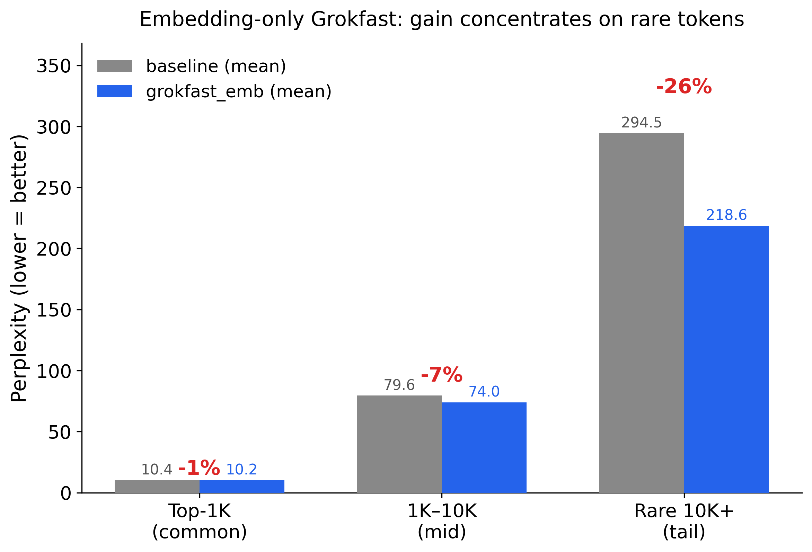

# Embedding-only Grokfast in LLM Pretraining: Empirical Results at 200M Parameters

Applying [Grokfast-EMA](https://arxiv.org/abs/2405.20233) to only the embedding and language-model head of a 200M-parameter LLaMA-style decoder reduces validation loss by **1.88%** (3.2250 → 3.1642) with under 0.2% compute overhead, consistent across 2 independent seeds. The gain is not uniform — it concentrates on rare tokens (-26% perplexity on the 10K+ tail) while common tokens improve minimally (-1%).



## Results

### Stage 2 — 200M model, 2B tokens (headline result)

| Vocab bucket | baseline perplexity | grokfast_emb | delta |
|---|---|---|---|
| Top-1K (common) | 10.4 | 10.2 | **-1%** |
| 1K–10K (mid) | 79.6 | 74.1 | **-7%** |
| Rare 10K+ (tail) | 294.5 | 218.6 | **-26%** |

Final val loss: baseline **3.2250 ± 0.0012** → grokfast_emb **3.1642 ± 0.0011** (2/2 seeds)

Compute overhead: **+0.2%** per step (EMA touches 2 tensors out of ~100+ parameter tensors).

### Stage 1 — 50M model, 500M tokens (four-arm ablation)

| Arm | Val loss | vs baseline |
|---|---|---|
| baseline | 3.853 | — |
| grokfast_full (all params) | 3.757 | -2.5% |
| grokfast_emb (embed only) | 3.725 | **-3.3%** |
| grokfast_nomomentum (β₁=0) | 3.754 | -2.6% |

`grokfast_nomomentum ≈ grokfast_full` confirms the effect is not just redundant momentum.

## Reproduce

```bash
git clone https://github.com/YOUR_USERNAME/grokfast-embeddings
cd grokfast-embeddings
pip install -r requirements.txt
```

**Single GPU** — simplest, runs both seeds sequentially:

```bash
python src/train.py --config configs/stage2.yaml --seeds 0 1
python src/train.py --config configs/stage2.yaml --report-only
```

**Multiple GPUs** — distribute seeds across GPUs, all finish in parallel. Each GPU gets a `--tag` so logs don't collide.

> The original results used 2× H100 SXM with seed 0 on GPU 0 and seed 1 on GPU 1, completing both seeds simultaneously in ~10h. This is **embarrassingly parallel**: each seed is a fully independent process with no inter-GPU communication, no DDP, no NCCL. You can use any number of GPUs — assign one or more seeds per GPU however fits your hardware.

```bash
# 4 GPUs, one seed each
for gpu in 0 1 2 3; do
  CUDA_VISIBLE_DEVICES=$gpu python src/train.py \
    --config configs/stage2.yaml --seeds $gpu --tag gpu$gpu &
done
wait
python src/train.py --config configs/stage2.yaml --report-only
```

Any number of GPUs works. `--seeds` controls which seeds run on that process; `--tag` namespaces its log file. The per-run JSONs are already unique by `{arm}_seed{N}.json` so multiple processes writing to the same `results_dir` never clobber each other.

## Method

**Grokfast-EMA** (Lee et al., 2024) modifies gradients between `backward()` and `optimizer.step()`:

```python
ema[p] = alpha * ema[p] + (1 - alpha) * p.grad   # track slow component
p.grad = p.grad + lamb * ema[p]                   # amplify slow component
```

`alpha=0.98`, `lamb=2.0` (original paper defaults). I apply this only to the two embedding matrices (`embed.weight` and `lm_head.weight`, which are tied), not to attention or MLP parameters. The hypothesis: the embedding matrices are the discrete-to-continuous interface and see every token; slow-component amplification preferentially helps rare tokens whose gradients update infrequently.

The implementation is ~20 lines in [`src/grokfast.py`](src/grokfast.py).

**Architecture**: LLaMA-style decoder (RMSNorm, RoPE, SwiGLU, tied embed/lm_head).
- Stage 1: 8L/512H/8A — 51M params
- Stage 2: 12L/1024H/16A — 205M params

**Data**: FineWeb-Edu (HuggingFace), GPT-2 tokenizer, pre-tokenized once to a flat `uint16` binary file.

**Fairness**: within each seed, baseline and grokfast_emb start from identical model weights. Data order is identical across all arms. The only variable that changes between arms is the optimizer modification.

## Caveats

- **Scale**: 200M params / 2B tokens is small by current standards. Whether the rare-token effect holds at 7B+ params and 1T+ tokens is unknown.
- **Momentum question**: arm 4 (`grokfast_nomomentum`, β₁=0) in Stage 1 matches `grokfast_full`, showing Grokfast is not purely redundant with Adam's momentum. However, the exact mechanism at the embedding level warrants further study.
- **Single dataset**: results are on FineWeb-Edu (filtered web text). Generalization to code, multilingual, or domain-specific data is untested.
- **No checkpoint release**: model weights were not saved during the runs reported here. A clean re-run with checkpoint saving is needed before a HuggingFace release.

## Scale to any model size

The architecture is fully parameterized. Create a new YAML config and plug in any size.

**Parameter count formula** (unique params, tied embed/lm_head):

```
P ≈ vocab_size × d_model  +  n_layers × (4 × d_model²  +  3 × d_model × d_ff)

d_ff = floor(2/3 × 4 × d_model / 128) × 128   # SwiGLU, rounded to nearest mult of 128
```

**Pre-computed configs:**

| Target | n_layers | d_model | n_heads | d_ff  | Actual params | Chinchilla tokens | LR    | grad_accum |
|--------|----------|---------|---------|-------|---------------|-------------------|-------|------------|
| 50M    | 8        | 512     | 8       | 1408  | ~51M          | ~1B               | 3e-4  | 1          |
| 200M   | 12       | 1024    | 16      | 2816  | ~206M         | ~4B               | 2e-4  | 4          |
| 1B     | 18       | 2048    | 32      | 5504  | ~1.01B        | ~20B              | 1.5e-4| 8          |
| 3B     | 36       | 2560    | 32      | 6912  | ~2.98B        | ~60B              | 1e-4  | 16         |
| 7B     | 33       | 4096    | 32      | 11008 | ~6.9B         | ~140B             | 7e-5  | 32         |

**Rules of thumb:**
- `head_dim = d_model / n_heads` — keep at 64 or 128
- LR: scales roughly as `3e-4 × sqrt(200M / P)` — always verify with a short LR sweep
- `grad_accum`: increase to keep `micro_batch_size × seq_len` fitting in GPU memory (target ~8–16 sequences per micro-batch)
- `tokens_total`: Chinchilla optimal is ~20× params; for a "does the signal exist?" check, 2× Chinchilla is enough to see the rare-token effect

**To run a new size**, copy the closest config and change the five architecture fields:

```bash
cp configs/stage2.yaml configs/my_1b.yaml
# edit n_layers, d_model, n_heads, d_ff, lr, grad_accum, tokens_total, data_cache
python src/train.py --config configs/my_1b.yaml --seeds 0 --tag gpu0
```

## Repo structure

```
grokfast-embeddings/
├── src/
│   ├── grokfast.py        # The 40-line scientific core — read this first
│   ├── model.py           # LlamaDecoder (RMSNorm, RoPE, SwiGLU)
│   ├── data.py            # tokenize_and_cache, TokenDataset, SequentialReader
│   ├── train.py           # Unified training loop (stage 1 + stage 2)
│   └── report.py          # Kill-criteria reporting
├── configs/
│   ├── stage1.yaml        # 50M / 500M tokens / 4 arms
│   └── stage2.yaml        # 200M / 2B tokens / 2 arms / 2 seeds
├── results/
│   ├── stage1/            # 4 per-arm JSONs (val loss, bucket perp, step times)
│   └── stage2/            # 4 per-run JSONs (2 arms x 2 seeds)
├── figures/               # PNG + SVG (regenerate with scripts/make_figures.py)
└── scripts/
    ├── make_figures.py
    └── reproduce.sh
```

## Citation

```bibtex
@misc{grokfast-embeddings-2026,
  title   = {Embedding-only Grokfast Reduces Rare-Token Perplexity in LLM Pretraining},
  author  = {Shaik Aman},
  year    = {2026},
  note    = {arXiv preprint, forthcoming},
  url     = {https://github.com/aman-source/grokfast-embeddings}
}
```

Based on: **Grokfast** (Lee et al., 2024) — [arXiv:2405.20233](https://arxiv.org/abs/2405.20233)

## License

MIT
